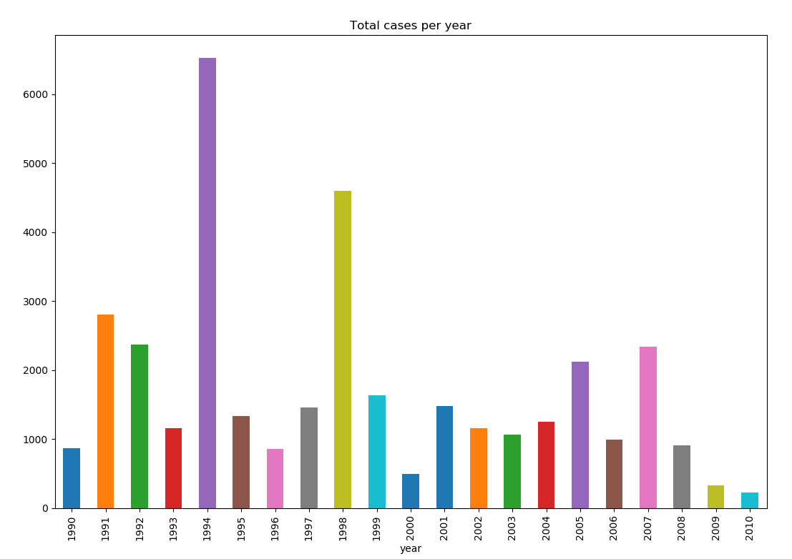

# DengAI

## Visualisation
Number of cases per city:

| City | Total Cases |
| ---- | ----------- |
| IQ | 3934 |
| SJ | 31993 |

Number of cases per year:
 

## Simple Models
Experimented with the following models:
* Linear Regression
* Random forest
* XGBoost

All of the models didn't perform well. The average Mean Squared Error (MSA) were around 30. 

